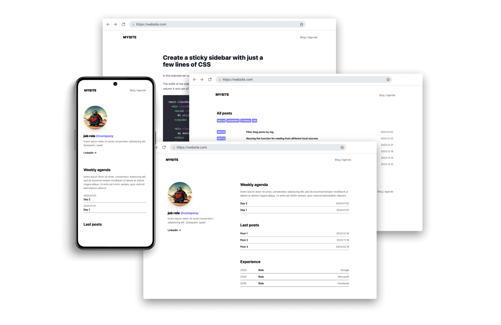

# NextPaper 📄


NextPaper is a minimal, responsive, accessible and SEO-friendly NextJs blog theme. This theme is designed and crafted based on [my personal site](https://stefanoperelli.com).

## 🔥 Features

- [x] Nextjs 14 with App router and SSG
- [x] Tailwind
- [x] Markdown (MDX Ready)
- [x] responsive (mobile ~ desktops)
- [x] SEO-friendly
- [x] Blog and Agenda
- [x] Metadata ready
- [x] Simple, light and clean UI

## 📖 Installation

```bash
git clone [this_repo_url] your_app_folder

cd your_app_folder

npm install

npm run dev
```

## 📜 License

Licensed under the MIT License, Copyright © 2024

---

Made with 🤍 by [Stefano Perelli](https://stefanoperelli.com)
